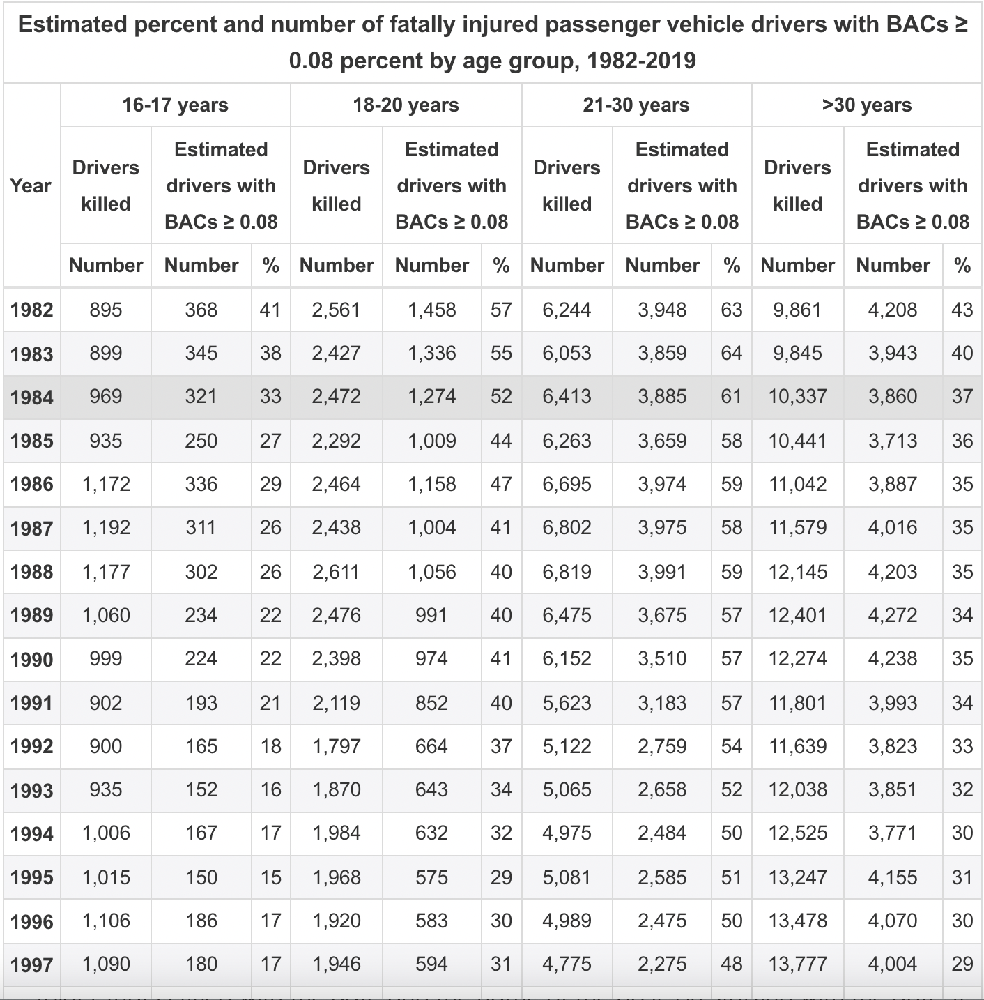
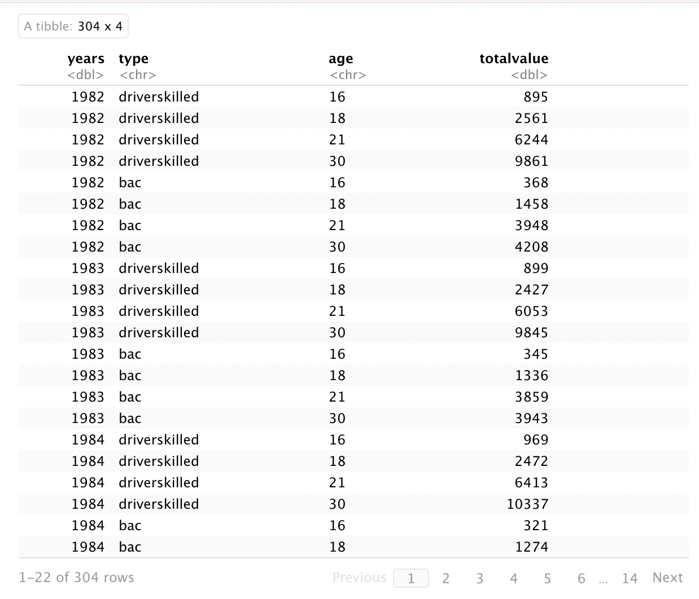
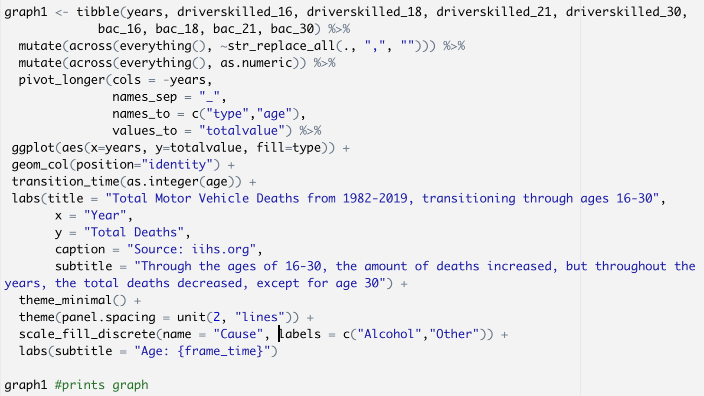
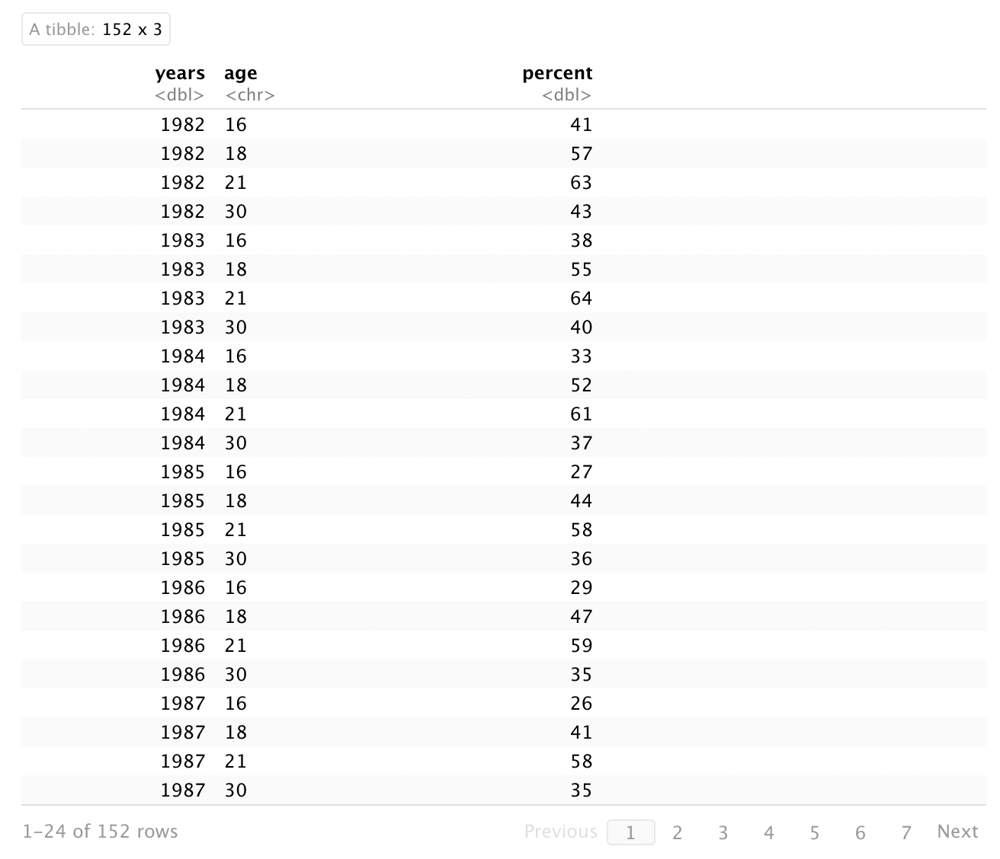
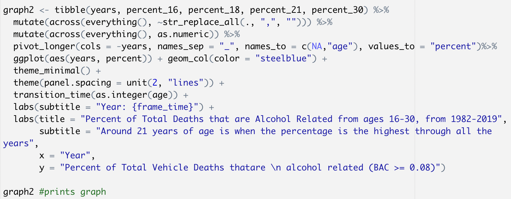

```{r setup, include=FALSE}
knitr::opts_chunk$set(echo = TRUE)
library(tidyverse)
library(readr)
library(dplyr)
library(lubridate)
library(rvest)
library(gganimate)
library(gifski)
library(png)
```

I got my data from this table that is on the website: https://www.iihs.org/topics/fatality-statistics/detail/teenagers#trends

{width=200}

## Graph 1:

Using the data in the table, I first got the Total deaths and amount of people who were drunk driving per age group and organized it in a table:

{width=200}

Then I used the following code to graph and implement transitions to the graph:

{width=200}

## Graph 2:

For graph 2, I took the same approach, but this time I used the percent of Total Deaths that were caused by Drunk Driving and organized it into a table that is sorted by age and year:

{width=200}

Using the following code, I graphed using age as a variable for the transitions:

{width=200}


